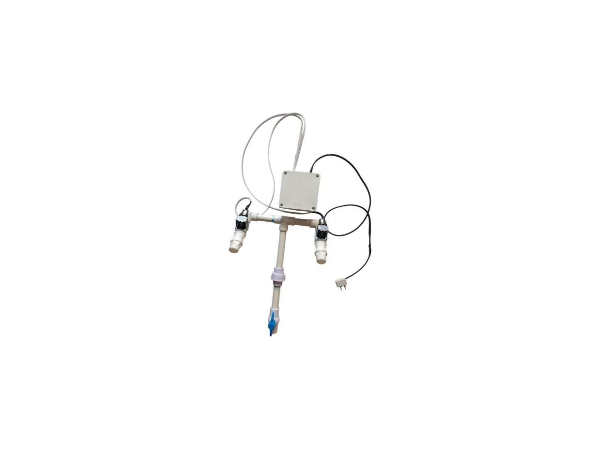
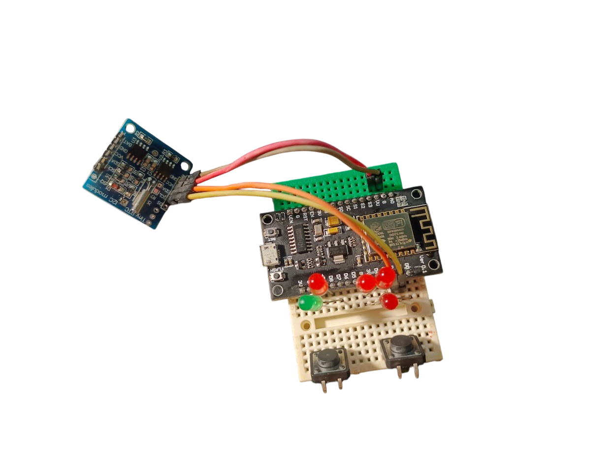
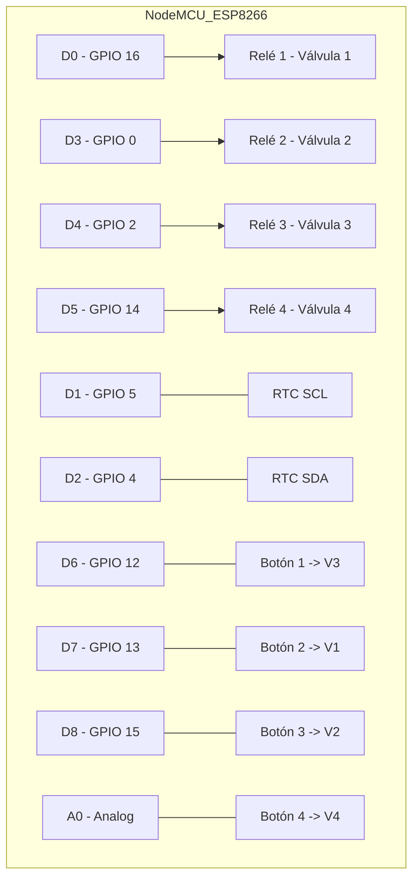
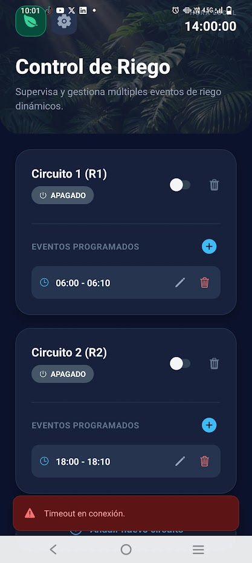

# 🌿 Smart Irrigation System (NodeMCU + Android)

Este proyecto es una solución integral de IoT para la gestión automatizada de sistemas de riego, combinando la potencia de un **ESP8266 (NodeMCU)** con una aplicación móvil moderna desarrollada en **React Native / Expo**.

## 🚀 Características Principales

- **Control de 4 Válvulas**: Gestión independiente de hasta 4 circuitos de riego mediante relés.
- **Modos de Operación**:
  - **Manual**: Botones físicos en el dispositivo y control remoto desde la App.
  - **Automático**: Programación de múltiples eventos horarios guardados permanentemente.
- **Precisión Horaria**: Integración con un módulo RTC (Real Time Clock) para mantener la hora incluso sin suministro eléctrico.
- **Interfaz Premium**: App móvil con modo oscuro, animaciones fluidas y monitorización en tiempo real.
- **Punto de Acceso Propio**: No requiere internet; la placa genera su propia red WiFi para el control local.

## 🛠️ Arquitectura de Hardware

- **Controlador**: NodeMCU (ESP8266).
- **Entradas**: 4 botones físicos (usando GPIOs específicos y el puerto analógico A0).
- **Reloj**: DS3231/DS1307 vía I2C.
- **Estabilidad**: Gestión de ahorro de energía WiFi desactivada para evitar desconexiones inesperadas.

## 🔌 Diagrama de Conexiones (Pinout)

## 📱 Aplicación Móvil

La aplicación permite:
- Visualizar el estado de cada válvula en tiempo real.
- Sincronizar el reloj de la placa con el del teléfono.
- Configurar encendidos y apagados programados con persistencia en la Flash del NodeMCU.

### 📥 Descarga la App
Puedes descargar el instalador (.APK) para Android directamente aquí:
> [!IMPORTANT]
> [**Descargar Smart Irrigation APK**](https://drive.google.com/file/d/1eLS3zvxFBGvCx_X4F9KoD0gAfnBQu_8u/view?usp=sharing)

## 📖 Instrucciones de Uso

1. **Conexión**: Conéctate a la red WiFi llamada `RIEGO_INTELIGENTE` desde tu teléfono.
2. **Abrir App**: Inicia la aplicación "Control de Riego".
3. **Sincronizar**: Ve a Ajustes y presiona "Hora Actual" para sincronizar el sistema.
4. **Programar**: Añade horarios de riego para cada circuito; se guardarán automáticamente en la placa.

---
*Desarrollado para la gestión eficiente del agua y automatización doméstica.*
